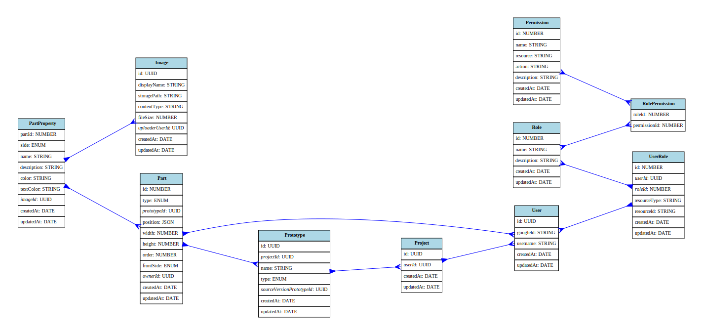

# KIBAKO

## 概要

ボードゲームのプロトタイプを作成するためのアプリケーション

## ドキュメント

- [API 仕様書](https://habitat-hub.github.io/board-game-prototype/)
- [開発ガイド](https://github.com/habitat-hub/board-game-prototype/wiki)

## ディレクトリ構成

- `frontend/`: フロントエンドのソースコード
- `backend/`: バックエンドのソースコード

## セットアップ

### 前提条件

- Node.js
- npm または yarn
- Docker, Docker Compose
- その他必要なツールやライブラリ

### インストール

リポジトリをクローン

```zsh
git clone https://github.com/habitat-hub/board-game-prototype.git
cd board-game-prototype
```

### フロントエンド・バックエンドのパッケージインストール

```zsh
make ci
```

### フロントエンドの環境変数設定

```zsh
cp ./frontend/.env_example ./frontend/.env.local
```

### バックエンドの環境変数設定

```zsh
cp ./backend/.env_example ./backend/.env
```

- Google Cloud の API キーを取得して、`./backend/.env` に設定する
- postgres の接続情報が異なる場合は、`./backend/.env` の DATABASE_URL を変更する

## 開発サーバー起動方法

### 一括で起動する場合

```zsh
make dev
```

### その他のコマンドを確認するには...

```zsh
make help
```

詳しくは [Makefile](https://github.com/habitat-hub/board-game-prototype/blob/develop/Makefile) を参照してください。

## API タイプ生成

このプロジェクトでは、バックエンドのSwagger仕様書から自動的にTypeScriptの型定義を生成しています。

### 自動生成ファイル

以下のファイルは自動生成されるため、直接編集しないでください：

- `frontend/src/__generated__/api/types/Api.ts`
- `frontend/src/__generated__/api/types/Auth.ts`
- `frontend/src/__generated__/api/types/data-contracts.ts`
- `frontend/src/__generated__/api/types/http-client.ts`

### 型定義の更新方法

1. バックエンドでSwagger定義を更新
2. バックエンドディレクトリで以下のコマンドを実行：

```zsh
cd backend
npm run generate-swagger
npm run generate-api-types
```

**注意**: これらのファイルは `frontend/eslint.config.js` で除外されており、lintチェックの対象外です。

## 自動生成物の配置ポリシー

- 自動生成される成果物は必ず `__generated__` ディレクトリ配下に配置します。
- バックエンドでは `backend/__generated__`, `backend/src/__generated__`, `backend/src/scripts/__generated__` を利用します。
- 既存の `__generated__` ディレクトリ外にある生成ファイルは順次移行し、新たに追加される生成処理も `__generated__` 配下を指すようにしてください。

## ER 図


